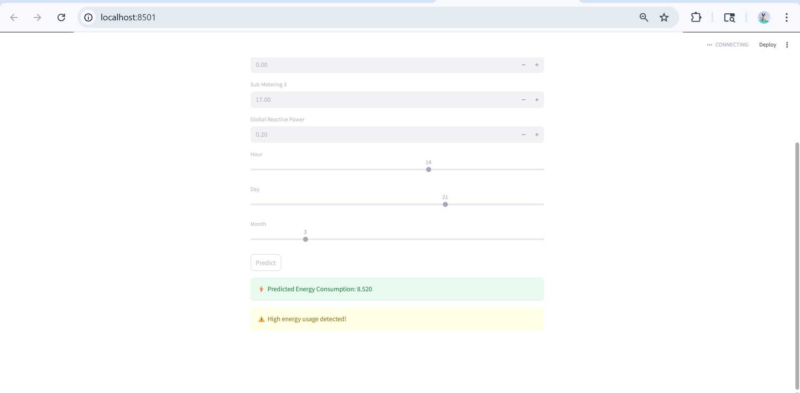

# ⚡ Energy Consumption Predictor

## 📌 Overview
This project predicts household energy consumption using a Machine Learning model.  
It is an end-to-end application where users can input electrical parameters and get real-time predictions through a web interface.

---

## 🌐 Live Demo
🔗 https://energy-ai-project-kdfvg59ssvi3jyndrpgsui.streamlit.app/

---

## 🚀 Features
- Real-time energy consumption prediction  
- Interactive web interface using Streamlit  
- Lightweight and optimized ML model  
- Data-driven categorization (Low / Normal / High usage)  
- Clean and user-friendly UI  

---

## 🛠 Tech Stack
- Python  
- Pandas  
- NumPy  
- Scikit-learn  
- Streamlit  
- Joblib  

---

## 📊 Input Parameters
The model takes the following inputs:

- Voltage  
- Sub Metering 1  
- Sub Metering 2  
- Sub Metering 3  
- Global Reactive Power  
- Hour  
- Day  
- Month  

---

## 🎯 Output
- Predicted Energy Consumption value  
- Usage category:
  - ✅ Low Energy Usage  
  - 👍 Normal Energy Usage  
  - ⚠️ High Energy Usage  

---

## 🧠 Machine Learning Model
- Algorithm: Random Forest Regressor  
- Optimized for:
  - Fast predictions  
  - Low memory usage  
  - Deployment readiness  

---

## 📈 Threshold Logic
Energy usage categories are determined based on dataset distribution:

- Low: < 1.4  
- Normal: 1.4 – 6.4  
- High: > 6.4  

These thresholds are derived from quartile values (Q1 & Q3) of the dataset.

---

## 📸 Application Preview


---

## ▶️ How to Run the Project

### 1. Clone the repository
```bash
git clone https://github.com/Veena121103/energy-ai-project.git
cd energy-ai-project
